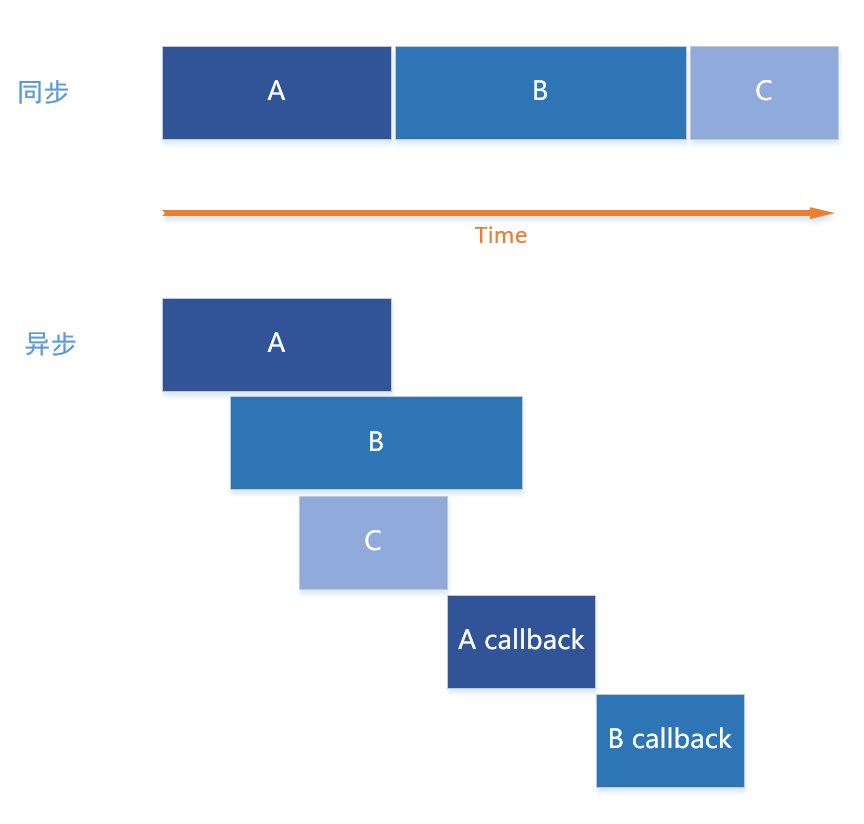
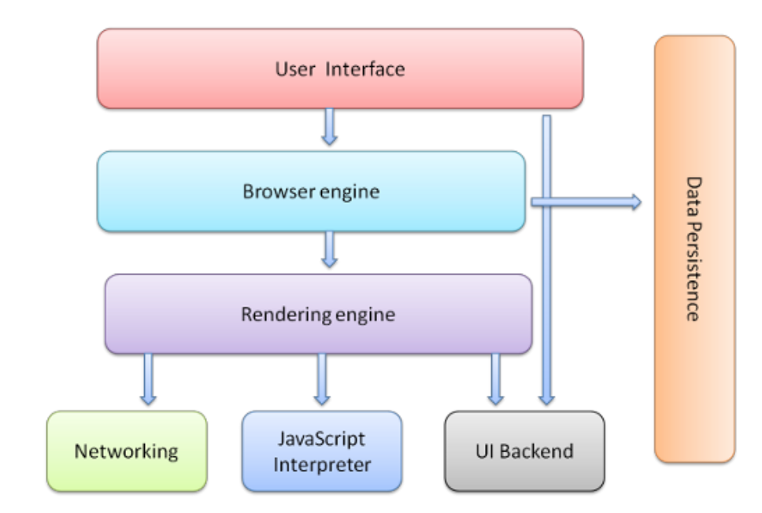
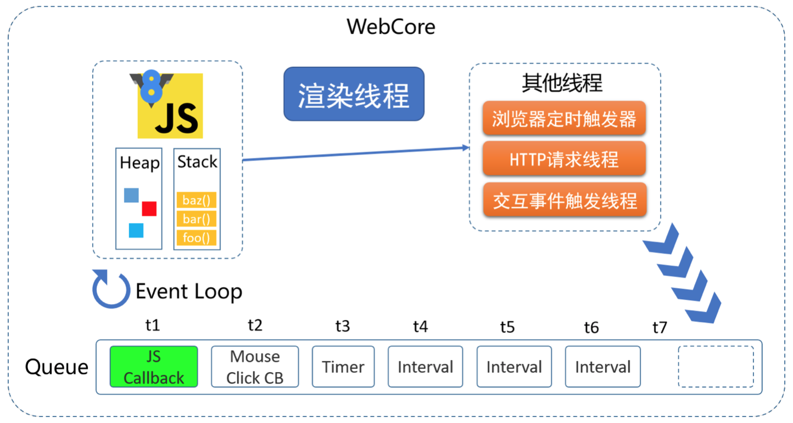
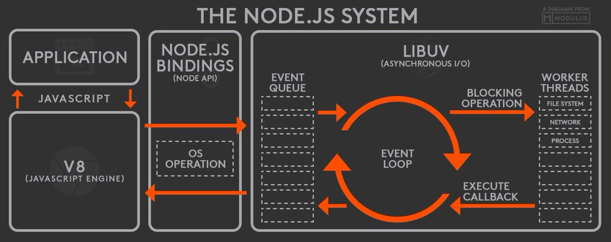
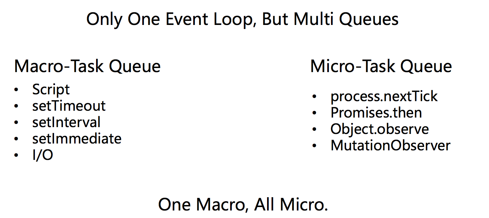

# 理解 JS 异步原理

当人们谈及 JS 时，总能提起它的事件循环（Event Loop）、非阻塞（Non-blocking）、回调（Callback）、异步（Asynchronous）、单线程（Single-threaded）和并发（Concurrency）等标签，这些标签到底是什么意思呢？

## 基本概念

### 线程（Thread）

官方解释：CPU 的**基本调度单位**。意味着可以被分配到不同的 CPU 核心上执行。

多线程目的：

- 功能模块划分，各司其职（如 GUI 应用）
- 提高运行效率（多核并行执行，或者单核里，某个线程 I/O 时，另一个线程继续执行）

多线程特点：

- 多线程在同一个进程里，共享内存和其他资源
- 多个线程可以同时写入由进程打开的同一个文件

### 进程（Progress）

官方解释：计算机中正在运行的程序**实体**。

早期面向进程设计的 OS 中，进程是基本执行实体；现代面向线程设计的 OS 中，进程不是基本运行单位，而是**线程的容器**。

一个程序可以有多个进程，一个进程可以拥有多个线程。

多进程特点：

- 通常指的是 OS 下运行多个进程，即多个应用同时运行
- 多进程程序，如 Chrome，每个页面/插件/拓展都是一个单独的进程，相互隔离
- OS 不允许多个进程同时写入同一个文件

> OS 区别： 
> 1. Window 创建进程开销很大，Linux 创建进程开销小
> 2. Window 多线程学习重点是资源争抢和同步，Linux 学习重点是进程间通讯；
> 3. 多核心 CPU 中的核心切换开销：由于进程的资源独立，所以进程在 CPU 核心之间切换开销小；由于每个线程共享资源，核心切换会导致资源的跨核心复制，所以线程的核心切换开销大；

### 串行 VS 并行 VS 并发

假设要处理 2 个任务 A 和 B ，那么：

- 串行（Sequential）：逐个处理任务（A->B）
- 并行（Parallelism）：同时处理多个任务 (A/B)
- 并发（Concurrency）：交替处理多个任务 (A1->B1->A2->A3-B2)

### 同步 VS 异步

- 同步（Synchronous）：串行执行任务，逐个完成任务
- 异步（Asynchronous）：每个任务都有回调，上一个任务还没执行完就可以开始执行下一个任务

<p align="center">
  
</p>

## 真正的耗时操作

在计算机系统中，CPU 的运行速度是很快的，真正把系统运行速度拉低的原因往往是因为对 I/O 设备的访问。常见的 I/O 操作包含存储器读取和网络通信。

具体到 JS 中，I/O 操作包含文件读取，XHR 请求等。

## 浏览器内核（WebCore）

一个浏览器界流传广泛的段子：

<p align="center">
  
</p>

浏览器组成：

<p align="center">
  
</p>

（图片来自 [aligarsiel.com](http://taligarsiel.com/Projects/howbrowserswork1.htm)）

浏览器内核实现多个线程异步执行。至少有三个常驻线程： JS Engine，界面渲染线程，浏览器事件触发线程。除此以外还有一些执行完就终止的线程，如HTTP请求线程。
这些异步线程都会产生不同的异步事件。

<p align="center">
  
</p>

JS 引擎是基于事件驱动（Event Loop）的。浏览器内部维护着一个事件队列（Queue），JS 引擎不断的询问该队列。如果队列中有事件，则获取该事件并处理。事件队列中的事件来源有很多，比如定时器线程、异步请求线程、交互事件触发线程等等，它们触发事件就只把事件推入队列尾部。因此，可以说 **JS 引擎线程消耗其他线程产生的事件**。

注意：**渲染线程与JS线程是互斥的**，因此在执行 JS 时，UI 是停止渲染的，因为 JS 的执行可能改变 DOM ，这对渲染线程来说 DOM 的状态是不确定的。

## Node.js

Node.js 的单线程 Event Loop

<p align="center">
  
</p>

(图片来自 [wprl](https://twitter.com/wprl/status/496643917559758848))

Node.js 底层使用的是 [libuv](https://github.com/libuv/libuv) 库来处理异步 I/O 。

## 实践

```javascript
// Example 1
console.log(1);
setTimeout(() => {
  console.log(2);
}, 100);
// 1 2
```

```javascript
// Example 2
setTimeout(() => {
  console.log(1);
}, 0);
console.log(2);
// 2 1
```

```javascript
// Example 3
console.log(1);
setTimeout(() => {
  while(true) {}
}, 100);
setTimeout(() => {
  console.log(2)
}, 200);
// 只输出 1
```

第一个定时任务进入死循环，导致第二个定时任务永远都不会执行。因为当前事件没处理完的话，JS 引擎不会去处理下一个事件。

```javascript
// Example 4
setTimeout(() => {
  console.log(1);
}, 0);
// 原生 Promise
new Promise((resolve, reject) => {
  console.log(2);
  resolve();
  console.log(3);
}).then(() => {
  console.log(4);
});
console.log(5);
// 2 3 5 4 1
```
为什么 4 在 1 之前？因为虽然只有一个事件循环，但是事件队列却有多个，Macro-Task Queue 和 Micro-Task Queue 。JS 引擎处理事件时，先处理掉所有的 Micro-Task ，然后再一个一个处理Macro-Task 。执行 Script 本身也是一个 Macro-Task。

所以，在 Example 4 中，首先执行的是 Script 本身，执行过程中，把 setTimeout 回调放入 Macro-Task 队列；Promise 构造函数的回调函数是同步执行的，then 回调被放入 Micro-Task 队列。所以在 Script 这个 Macro-Task 执行完后，会首先清空 Micro-Task 队列，然后才是下一个 Macro-Task，即 setTimeout 回调。



## Reference

- [知乎：多线程有什么用](https://www.zhihu.com/question/19901763/answer/13299543)
- [JavaScript的单线程和异步](https://zhuanlan.zhihu.com/p/23659122)
- [JavaScript的线程问题](http://blog.csdn.net/kfanning/article/details/5768776)
- [Promise的队列和setTimeout的队列有何关联](https://www.zhihu.com/question/36972010)
- [Event loop](http://www.ruanyifeng.com/blog/2014/10/event-loop.html)
- [JavaScript单线程](http://greengerong.com/blog/2015/10/27/javascript-single-thread-and-browser-event-loop/)
- [图片：Node.js系统框图](https://twitter.com/wprl/status/496643917559758848)